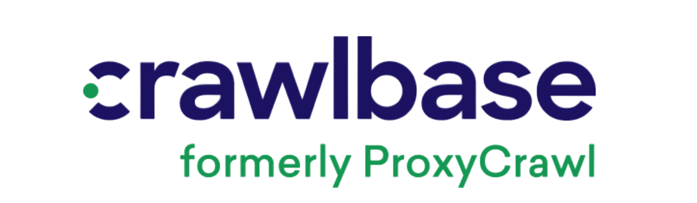

#  Gemini API  <a href="https://pypi.org/project/python-gemini-api/"> </a>


<p align="right">
    <a href="https://github.com/dsdanielpark/Gemini-API"></a> 
    <a href="https://github.com/psf/black"></a>
    <a href="https://hits.seeyoufarm.com"></a>
    <a href="https://pypistats.org/packages/python-gemini-api"></a>
<!-- <a href="https://github.com/dsdanielpark/Gemini-API/stargazers"></a> -->
</p>


https://github.com/dsdanielpark/Gemini-API/assets/81407603/e0c11d4f-3fe1-4cbb-ba79-d9f89b637324


An **unofficial* Python wrapper, [python-gemini-api](https://pypi.org/project/python-gemini-api/), is available for users facing frequent authentication issues or unable to use [Google Authentication](https://developers.google.com/identity/protocols/oauth2?hl=en). This wrapper uses cookie values to interact with [Google Gemini](https://gemini.google.com) through reverse-engineering. The project involved a collaboration with [Antonio Cheong](https://github.com/acheong08).

On the official side, Google provides partially free, clean [official Gemini APIs and SDKs](https://aistudio.google.com/), which can be accessed and utilized neatly via Python packages, [google-generativeai](https://pypi.org/project/google-generativeai/). 
<br>

<br>


> [!TIP]
> | 2024-03-26 | [[See Code Examples]](https://github.com/dsdanielpark/Gemini-API/blob/main/documents/README_OPENROUTER.md)
> 
> Check out temporarily free Open-source LLM APIs with Open Router.  (Free limit: 10 requests/minute) 

<br>

## Contents

- [ Gemini API   ](#-gemini-api---)
  - [What is Gemini? 🔒](#what-is-gemini)
  - [What is Python-Gemini-API? 🔐](#what-is-python-gemini-api)
      - [Installation ✅](#installation-)
      - [Authentication ✅](#authentication)
      - [Quick Start ✅](#quick-start)
      - [Usage](#usage)
        - [# 01. Initialization ✅](#-01-initialization)
        - [# 02. Generate content](#-02-generate-content)
        - [# 03. Send request](#-03-send-request)
        - [# 04. Text generation](#-04-text-generation)
        - [# 05. Image generation](#-05-image-generation)
        - [# 06. Retrieving Images from Gemini Responses](#-06-retrieving-images-from-gemini-responses)
        - [# 07. Generate content from images](#-07-generate-content-from-images)
        - [# 08. Generate content using Google Services](#-08-generate-content-using-google-services)
        - [# 09. Fix context setting RCID](#-09-fix-context-setting-rcid)
        - [# 10. Changing the Selected Response from 0 to *n*](#-10-changing-the-selected-response-from-0-to-n)
        - [# 11. Generate custom content](#-11-generate-custom-content)
      - [Further](#further)
  - [Google Proprietary LLM, Gemini 🔒](#google-proprietary-llm-gemini)
  - [Google Open-source LLMs 🤝](#google-open-source-llms)
      - [Open-source LLM, Gemma 🤝](#open-source-llm-gemma)
      - [Open-source LLM, Code Gemma 🤝](#open-source-llm-code-gemma)
  - [Utilize free open-source LLM API through Open Router 🤝 ✅](#utilize-free-open-source-llm-api-through-open-router)


<br>

## What is [Gemini](https://deepmind.google/technologies/gemini/#introduction)?

| [Paper](https://arxiv.org/abs/2312.11805) | [Official Website](https://deepmind.google/technologies/gemini/#introduction) | [Official API](https://aistudio.google.com/) | [API Documents](https://cloud.google.com/vertex-ai/docs/generative-ai/model-reference/gemini) |

Gemini is a family of generative AI models developed by Google DeepMind that is designed for multimodal use cases. The Gemini API gives you access to the Gemini Pro and Gemini Pro Vision models. In February 2024, Google's **Bard** service was changed to **Gemini**.

#### Overview of Google LLMs

| Model | Type | Access | Details
|:-------:|:------:|:--------:|---------
[Gemini](https://huggingface.co/google/gemma-7b) | Proprietary | API <sup>[[13](https://ai.google.dev/tutorials/ai-studio_quickstart)] | A proprietary multimodal AI by Google DeepMind, including advanced models such as Gemini Pro and Gemini Pro Vision. Access is restricted to API usage; additional insights may be obtained through the paper and website. <sup>[[1](https://arxiv.org/abs/2312.11805)][[2](https://deepmind.google/technologies/gemini/#introduction)]</sup>
[Gemma](https://huggingface.co/google/gemma-7b) | Open Source | [Downloadable](https://huggingface.co/google/gemma-7b) <br>[Free API](https://github.com/dsdanielpark/Gemini-API?tab=readme-ov-file#utilize-free-open-source-llm-api-through-open-router) | An open-source text-to-text language model suitable for tasks like QA and summarization. Weights are downloadable for on-premises use, and detailed documentation is provided via the paper and website. <sup>[[3](https://arxiv.org/abs/2403.08295)][[4](https://ai.google.dev/gemma/docs)]</sup>
[Code Gemma](https://huggingface.co/google/codegemma-7b-it) | Open Source | [Downloadable](https://huggingface.co/google/codegemma-7b-it) | Designed specifically for programming tasks, this open-source model offers downloadable weights to assist developers with code generation and similar activities. Refer to the associated paper, blog post, and Hugging Face collection for more information. <sup>[[5](https://storage.googleapis.com/deepmind-media/gemma/codegemma_report.pdf?utm_source=substack&utm_medium=email)][[6](https://huggingface.co/blog/codegemma)][[7](https://huggingface.co/collections/google/codegemma-release-66152ac7b683e2667abdee11)]</sup>


<br>

## What is [Python-Gemini-API](https://github.com/dsdanielpark/Gemini-API)?

This is a Python wrapper derived from the [Bard API](https://github.com/dsdanielpark/Bard-API) project, designed to retrieve responses from Gemini Web in REST format. **Synchronous clients are preferred over asynchronous ones for Gemini because of rate limiting and blocking concerns.**

## Installation 📦
```
pip install python-gemini-api
```
```
pip install git+https://github.com/dsdanielpark/Gemini-API.git
```
For the updated version, use as follows:
```
pip install -q -U python-gemini-api
```


## Authentication

1. Visit https://gemini.google.com/ <br>
    With browser open, try auto-collecting cookies first.
    ```python
    from gemini import Gemini
    
    client = Gemini(auto_cookies=True)

    # Testing needed as cookies vary by region.
    # client = Gemini(auto_cookies=True, target_cookies=["__Secure-1PSID", "__Secure-1PSIDTS"])
    # client = Gemini(auto_cookies=True, target_cookies="all") # You can pass whole cookies

    response = client.generate_content("Hello, Gemini. What's the weather like in Seoul today?")
    print(response.payload)
    ```
2. *(Manually)* `F12` for browser console → `Session: Application` → `Cookies` → Copy the value of some working cookie sets. If it doesn't work, go to step 3.
    <details><summary>Some working cookie sets</summary>
    Cookies may vary by account or region. 
      
    First try `__Secure-1PSIDCC` alone. If it doesn't work, use `__Secure-1PSID` and `__Secure-1PSIDTS`. Still no success? Try these four cookies: `__Secure-1PSIDCC`, `__Secure-1PSID`, `__Secure-1PSIDTS`, `NID`. If none work, proceed to step 3 and consider sending the entire cookie file.
    
    </details>

3. *(Recommended)* Export Gemini site cookies via a browser extension. For instance, use Chrome extension [ExportThisCookies](https://chromewebstore.google.com/detail/exportthiscookie/dannllckdimllhkiplchkcaoheibealk), open, and copy the txt file contents.


<br>

<details><summary>Further: For manual collection or Required for a few users upon error</summary>

4. For manual cookie collection, refer to [this image](assets/cookies.pdf). Press F12 → Network → Send any prompt to Gemini webui → Click the post address starting with "https://gemini.google.com/_/BardChatUi/data/assistant.lamda.BardFrontendService/StreamGenerate" → Headers → Request Headers → Cookie → Copy and Reformat as JSON manually.
5. *(Required for a few users upon error)* If errors persist after manually collecting cookies, refresh the Gemini website and collect cookies again. If errors continue, some users may need to manually set the nonce value. To do this: Press F12 → Network → Send any prompt to Gemini webui → Click the post address starting with "https://gemini.google.com/_/BardChatUi/data/assistant.lamda.BardFrontendService/StreamGenerate" → Payload → Form Data → Copy the "at" key value. See [this image](assets/nonce_value.pdf) for reference.
</details>


> [!IMPORTANT] 
> Experiment with different Google accounts and browser settings to find a working cookie. Success may vary by IP and account status. Once connected, a cookie typically remains effective over a month. Keep testing until successful.


<br>

## Quick Start

**Generate content:** returns parsed response.
```python
from gemini import Gemini

cookies = {"<key>" : "<value>"} # Cookies may vary by account or region. Consider sending the entire cookie file.
client = Gemini(cookies=cookies) # You can use various args

response = client.generate_content("Hello, Gemini. What's the weather like in Seoul today?")
response.payload
```

**Generate content from image:** you can use image as input.
```python
from gemini import Gemini

cookies = {"<key>" : "<value>"}
client = Gemini(cookies=cookies) # You can use various args

response = client.generate_content("What does the text in this image say?", image='folder/image.jpg')
response.payload
```

> [!NOTE] 
> If the generate_content method returns an empty payload, try executing it again without reinitializing the Gemini object.

<br><br>

## Usage

*Setting language and Gemini version using environment variables:*

Setting Gemini response language (Optional): Check supported languages [here](https://developers.google.com/hotels/hotel-prices/dev-guide/country-codes). Default is English.

```python
import os

os.environ["GEMINI_LANGUAGE"] = "KR"  # Setting Gemini response language (Optional)
os.environ["GEMINI_ULTRA"] = "1"      # Switch to Gemini-advanced response (Experimental, Optional)
# In some accounts, access to Gemini Ultra may not be available. If that's the case, please revert it back to "0".
```


<br>

### # 01. Initialization
Please explicitly declare `cookies` in dict format. You can also enter the path to the file containing the cookie with `cookie_fp`(*.json, *.txt supported). Check sample cookie files in [assets](https://github.com/dsdanielpark/Gemini-API/tree/main/assets) folder.


```python
from gemini import Gemini

cookies = {
    "__Secure-1PSIDCC" : "value",
    "__Secure-1PSID" : "value",
    "__Secure-1PSIDTS" : "value",
    "NID" : "value",
    # Cookies may vary by account or region. Consider sending the entire cookie file.
  }

client = Gemini(cookies=cookies)
# client = Gemini(cookie_fp="folder/cookie_file.json") # (*.json, *.txt) are supported.
# client = Gemini(auto_cookies=True) # Or use auto_cookies paprameter
```

##### Auto Cookie Update
For `auto_cookie` to be set to `True`, and adjust `target_cookies`. Gemini WebUI must be active in the browser. The [browser_cookie3](https://github.com/borisbabic/browser_cookie3) enables automatic cookie collection, though updates may not be complete yet.


<br>

### # 02. Generate content
Returns Gemini's response, but the first one might be empty. 


```python
from gemini import Gemini

cookies = {}
client = Gemini(cookies=cookies)

prompt = "Tell me about Large Language Model."
response = client.generate_content(prompt)
print(response.payload)
```


> [!IMPORTANT]
>  DO NOT send same prompt repeatly. **If the session connects successfully and `generate_content` runs well, CLOSE Gemini website.** If Gemini web stays open in the browser, cookies may expire faster. 

<br>

The output of the generate_content function is `GeminiModelOutput`, with the following structure: 
- *rcid*: returns the response candidate id of the chosen candidate.
- *text*: returns the text of the chosen candidate.
- *code*: returns the codes of the chosen candidate.
- *web_images*: returns a list of web images from the chosen candidate.
- *generated_images*: returns a list of generated images from the chosen candidate.
- *payload*: returns the response dictionary, if available.
https://github.com/dsdanielpark/Gemini-API/blob/fdf064c57bc1fb47fbbb4b93067618a200e77f62/gemini/src/model/output.py#L16


<br>


### # 03. Send request
Send request: returns the request's payload and status_code, making debugging easier.
```python
from gemini import Gemini

cookies = {} 
client = Gemini(cookies=cookies) 

response_text, response_status = client.send_request("Hello, Gemini. Tell me about Large Language Models.")
print(response_text)
```
You can track the total number of requests made by accessing the `request_count` property within the `Gemini` class.

<br>

### # 04. Text generation
Returns text generated by Gemini.
```python
from gemini import Gemini

cookies = {}
client = Gemini(cookies=cookies)

prompt = "Hello, Gemini. Tell me about Large Language Models."
response = client.generate_content(prompt)
print(response.text)
```


<br>

### # 05. Image generation
Returns images generated by Gemini.

*Async downloader*

```python
from gemini import Gemini, GeminiImage

cookies = {}
client = Gemini(cookies=cookies)

response = client.generate_content("Hello, Gemini. Tell me about Large Language Models.")
generated_images = response.generated_images # Check generated images [Dict]

await GeminiImage.save(generated_images, "output", cookies)
# image_data_dict = await GeminiImage.fetch_images_dict(generated_images, cookies)
# await GeminiImage.save_images(image_data_dict, "output")
```


<details><summary>Further</summary>

*Display images in IPython*
  You can display the image or transmit it to another application in byte format.
  
  ```python
  import io
  from gemini import Gemini, GeminiImage
  from IPython.display import display, Image
  
  cookies = {}
  client = Gemini(cookies=cookies)
  bytes_images_dict = GeminiImage.fetch_images_dict_sync(generated_images, cookies) # Get bytes images dict
  
  for image_name, image_bytes in bytes_images_dict.items():
      print(image_name)
      image = Image(data=image_bytes)
      display(image)
  ```


*Sync downloader*
```python
from gemini import Gemini, GeminiImage

cookies = {}
client = Gemini(cookies=cookies)

response = client.generate_content("Create illustrations of Seoul, South Korea.")
generated_images = response.generated_images # Check generated images [Dict]

GeminiImage.save_sync(generated_images, save_path="output", cookies=cookies)

# You can use byte type image dict for printing images as follow:
# bytes_images_dict = GeminiImage.fetch_images_dict_sync(generated_images, cookies) # Get bytes images dict
# GeminiImage.save_images_sync(bytes_images_dict, path="output") # Save to dir
```

*Async downloader wrapper*

```python
import asyncio
from gemini import GeminiImage

async def save_generated_images(generated_images, save_path="output", cookies=cookies):
    await GeminiImage.save(generated_images, save_path=save_path, cookies=cookies)

# Run the async function
if __name__ == "__main__":
    cookies = {}
    client = Gemini(cookies=cookies)

    response = client.generate_content("Create illustrations of Seoul, South Korea.")

    generated_images = response.generated_images  
    asyncio.run(save_generated_images(generated_images, save_path="output", cookies=cookies))
```

`GeminiImage.save` method logic

```python
import asyncio
from gemini import Gemini, GeminiImage

async def save_generated_images(generated_images, save_path="output", cookies=cookies):
    image_data_dict = await GeminiImage.fetch_images_dict(generated_images, cookies)  # Get bytes images dict asynchronously
    await GeminiImage.save_images(image_data_dict, save_path=save_path)  

# Run the async function
if __name__ == "__main__":
    cookies = {}
    client = Gemini(cookies=cookies)

    response = client.generate_content("Create illustrations of Seoul, South Korea.")

    generated_images = response.generated_images 
    asyncio.run(save_generated_images(generated_images, save_path="output", cookies=cookies))
```

</details>

> [!NOTE]
> Use GeminiImage for image processing. `web_images` works without cookies, but for images like `generated_image` from Gemini, pass cookies. Cookies are needed to download images from Google's storage. Check the response or use existing cookies variable.

<br>

### # 06. Retrieving Images from Gemini Responses
Returns images in response of Gemini.


*Async downloader*
```python
from gemini import Gemini, GeminiImage

cookies = {}
client = Gemini(cookies=cookies)

response = client.generate_content("Give me a picture of Stanford.")
response_images = response.web_images # Check generated images

await GeminiImage.save(response_images, "output")
# image_data_dict = await GeminiImage.fetch_images_dict(response_images)
# await GeminiImage.save_images(image_data_dict, "output")
```

<details><summary>Further</summary>


*Sync downloader*
```python
from gemini import Gemini, GeminiImage

cookies = {}
client = Gemini(cookies=cookies)

response = client.generate_content("Give me a picture of Stanford.")
response_images = response.web_images # Check response images

GeminiImage.save_sync(response_images, save_path="output")

# You can use byte type image dict as follow:
# bytes_images_dict = GeminiImage.fetch_bytes_sync(response_images) # Get bytes images dict
# GeminiImage.save_images_sync(bytes_images_dict, save_path="output") # Save to path
```

*Async downloader wrapper*
```python
import asyncio
from gemini import Gemini, GeminiImage
   
async def save_response_web_imagse(response_images, save_path="output"):
    await GeminiImage.save(response_images, save_path=save_path)

if __name__ == "__main__":
    cookies = {}
    client = Gemini(cookies=cookies)
    response = client.generate_content("Give me a picture of Stanford.")
    response_images = response.web_images  
    asyncio.run(save_response_web_imagse(response_images, save_path="output"))
```

`GeminiImage.save` method logic

```python
import asyncio
from gemini import Gemini, GeminiImage

async def save_response_web_imagse(response_images, save_path="output"):
    image_data_dict = await GeminiImage.fetch_images_dict(response_images)  # Get bytes images dict asynchronously
    await GeminiImage.save_images(image_data_dict, save_path=save_path)  

# Run the async function
if __name__ == "__main__":
    cookies = {}
    client = Gemini(cookies=cookies)
    response = client.generate_content("Give me a picture of Stanford.")
    response_images = response.web_images 
    asyncio.run(save_response_web_imagse(response_images, save_path="output"))
```

</details>

<br>

### # 07. Generate content from images
Takes an image as input and returns a response.

```python
image = 'folder/image.jpg'
# image = open('folder/image.jpg', 'rb').read() # (jpg, jpeg, png, webp) are supported.

# Image file path or Byte-formatted image array
response = client.generate_content("What does the text in this image say?", image=image)
print(response)
```

<br>

### # 08. Generate content using Google Services
To begin, you must link Google Workspace to activate this extension via the [Gemini web extension](https://gemini.google.com/extensions). Please refer to the [official notice](https://support.google.com/gemini/answer/13695044) and review the [privacy policies](https://support.google.com/gemini/answer/13594961?visit_id=638457301410420313-1578971242&p=privacy_help&rd=1) for more details.

*extention flags*
```
@Gmail, @Google Drive, @Google Docs, @Google Maps, @Google Flights, @Google Hotels, @YouTube
```
```python
response = client.generate_content("@YouTube Search clips related with Google Gemini")
response.response_dict
```
<details><summary>Extension description</summary>
  
- Google Workspace
  - Services: **@Gmail, @Google Drive, @Google Docs** 
  - Description: Summarize, search, and find desired information quickly in your content for efficient personal task management.
  - Features: Information retrieval, document summarization, information categorization

- Google Maps
  - Service: **@Google Maps**
  - Description: Execute plans using location-based information. Note: Google Maps features may be limited in some regions.
  - Features: Route guidance, nearby search, navigation

- Google Flights
  - Service: **@Google Flights**
  - Description: Search real-time flight information to plan tailored travel itineraries.
  - Features: Holiday preparation, price comparison, trip planning

- Google Hotels
  - Service: **@Google Hotels**
  - Description: Search for hotels considering what matters most to you, like having a conversation with a friend.
  - Features: Packing for travel, sightseeing, special relaxation

- YouTube
  - Service: **@YouTube**
  - Description: Explore YouTube videos and ask questions about what interests you.
  - Features: Problem-solving, generating ideas, search, exploring topics
</details>

<br>


### # 09. Fix context setting RCID
You can specify a particular response by setting its Response Candidate ID(RCID).

```python
# Generate content for the prompt "Give me some information about the USA."
response1 = client.generate_content("Give me some information about the USA.")
# After reviewing the responses, choose the one you prefer and copy its RCID.
client.rcid = "rc_xxxx"

# Now, generate content for the next prompt "How long does it take from LA to New York?"
response2 = client.generate_content("How long does it take from LA to New York?")

# However, RCID may not persist. If parsing fails, reset `client.rcid` to None.
# client.rcid = None
```


<br>

### # 10. Changing the Selected Response from 0 to *n*
In Gemini, generate_content returns the first response. This may vary depending on length or sorting. Therefore, you can specify the index of the chosen response from 0 to *n* as follows. However, if there is only one response, revert it back to 0.
```python
from gemini import GeminiModelOutput

GeminiModelOutput.chosen = 1 # default is 0
response_choice_1 = client.generate_content("Give me some information about the USA.")

# If not all Gemini returns are necessarily plural, revert back to 0 in case of errors.
#  GeminiModelOutput.chosen = 0
```

<br>

### # 11. Generate custom content 
Parse the response text to extract desired values.


Using `Gemini.generate_custom_content`, specify custom parsing to extract specific values. Utilize ParseMethod1 and ParseMethod2 by default, and you can pass custom parsing methods as arguments if desired. Refer to [custom_parser.py](https://github.com/dsdanielpark/Gemini-API/blob/main/gemini/src/model/parser/custom_parser.py).

```python
# You can create a parser method that takes response_text as the input for custom_parser.
response_text, response_status = client.send_request("Give me some information about the USA.")

# Use custom_parser function or class inheriting from BaseParser
response = client.generate_custom_content("Give me some information about the USA.", *custom_parser)
```

https://github.com/dsdanielpark/Gemini-API/blob/31b842488bbc5429ad9c74b1d8b00e20d94e8cb1/gemini/client.py#L323
<br>

## Further

### Use rotating proxies via [Smart Proxy by Crawlbase](https://crawlbase.com/docs/smart-proxy/?utm_source=github_ad&utm_medium=social&utm_campaign=bard_api)

If you want to **avoid blocked requests** and bans, then use [Smart Proxy by Crawlbase](https://crawlbase.com/docs/smart-proxy/?utm_source=github_ad&utm_medium=social&utm_campaign=bard_api). It forwards your connection requests to a **randomly rotating IP address** in a pool of proxies before reaching the target website. The combination of AI and ML make it more effective to avoid CAPTCHAs and blocks. The argument at the [Secure Sockets Layer (SSL)](https://en.wikipedia.org/wiki/Transport_Layer_Security) level may need to be added to the header. Use it in conjunction with `verify=False`.

```python
# Get your proxy url at crawlbase https://crawlbase.com/docs/smart-proxy/get/
proxy_url = "http://xxxxx:@smartproxy.crawlbase.com:8012" 
proxies = {"http": proxy_url, "https": proxy_url}

client = Gemini(cookies=cookies, proxies=proxies, timeout=30, verify=False)
client.session.header["crawlbaseAPI-Parameters"] = "country=US"
client.generate_content("Hello, Gemini. Give me a beautiful photo of Seoul's scenery.")
```


### Reusable session object
For standard cases, use Gemini class; for exceptions, use session objects. When creating a new bot Gemini server, adjust Headers.MAIN.
```python
import requests
from gemini import Gemini, Headers

cookies = {} 

session = requests.Session()
session.headers = Headers.MAIN
for key, value in cookies.items():
    session.cookies.update({key: value})

client = Gemini(session=session) # You can use various args
response = client.generate_content("Hello, Gemini. Tell me about Large Language Model.")
```


<br>

## [More features](https://github.com/dsdanielpark/Gemini-API/blob/main/documents/README_DEV.md)
Explore additional features in [this document](https://github.com/dsdanielpark/Gemini-API/blob/main/documents/README_DEV.md).

If you want to develop your own simple code, you can start from [this simple code example](https://github.com/dsdanielpark/Gemini-API/blob/main/script/sample.ipynb).  

<br>

---

<br>

## Google Proprietary LLM, [Gemini](https://gemini.google.com/app) 

#### Official API

Prepare necessary items and obtain an API key at [Google AI Studio](https://aistudio.google.com/app/apikey). Install on Python 3.9 or higher and enter the issued API key. Refer to the [tutorial](https://ai.google.dev/gemini-api/docs/get-started/python) for details.

```
pip install -q -U google-generativeai
```
```python
import google.generativeai as genai

GOOGLE_API_KEY="<your_gemini_api_key>"
genai.configure(api_key=GOOGLE_API_KEY)

model = genai.GenerativeModel('gemini-pro')
response = model.generate_content("Write me a poem about Machine Learning.")

print(response.text)
```

## Google Open-source LLMs

If you have sufficient GPU resources, you can download weights directly instead of using the Gemini API to generate content. Consider Gemma and Code Gemma, an open-source models **available for on-premises use**.


### Open-source LLM, [Gemma](https://huggingface.co/google/gemma-7b)

Gemma models are Google's lightweight, advanced text-to-text, decoder-only language models, derived from Gemini research. Available in English, they offer open weights and variants, ideal for tasks like question answering and summarization. For more infomation, visit [Gemma-7b](https://huggingface.co/google/gemma-7b) model card.

#### How to use Gemma
```python
from transformers import AutoTokenizer, AutoModelForCausalLM

tokenizer = AutoTokenizer.from_pretrained("google/gemma-7b")
model = AutoModelForCausalLM.from_pretrained("google/gemma-7b")

input_text = "Write me a poem about Machine Learning."
input_ids = tokenizer(input_text, return_tensors="pt")

outputs = model.generate(**input_ids)
print(tokenizer.decode(outputs[0]))
```

### Open-source LLM, [Code Gemma](https://huggingface.co/collections/google/codegemma-release-66152ac7b683e2667abdee11)

CodeGemma, which is an official release from Google for code LLMs, was released on April 9, 2024. It provides three models specifically designed for generating and interacting with code. You can explore the [Code Gemma models](https://huggingface.co/collections/google/codegemma-release-66152ac7b683e2667abdee11) and view the [model card](https://huggingface.co/google/codegemma-7b-it) for more details.

#### How to use Code Gemma
```python
from transformers import GemmaTokenizer, AutoModelForCausalLM

tokenizer = GemmaTokenizer.from_pretrained("google/codegemma-7b-it")
model = AutoModelForCausalLM.from_pretrained("google/codegemma-7b-it")

input_text = "Write me a Python function to calculate the nth fibonacci number."
input_ids = tokenizer(input_text, return_tensors="pt")

outputs = model.generate(**input_ids)
print(tokenizer.decode(outputs[0]))
```


<br>

---

<br>


## Utilize free open-source LLM API through [Open Router](https://openrouter.ai/)
OpenRouter offers temporary free inference for select models. Obtain an API key from [Open Router API](https://openrouter.ai/keys) and check free models at [Open Router models](https://openrouter.ai/docs#models). Use models with a 0-dollar token cost primarily; other models may incur charges. See more at [free open-source LLM API guide](https://github.com/dsdanielpark/Gemini-API/blob/main/documents/README_OPENROUTER.md).

**Sync client is favored over async for Gemini due to rate limiting and blocking issues**, but OpenRouter offers reliable open-source LLMs for [async implementation](https://github.com/dsdanielpark/Gemini-API/blob/main/documents/README_OPENROUTER.md#openrouter-async-api-client).

```python
from gemini import OpenRouter

OPENROUTER_API_KEY = "<your_open_router_api_key>"
gemma_client = OpenRouter(api_key=OPENROUTER_API_KEY, model="google/gemma-7b-it:free")

prompt = "Do you know UCA academy in Korea? https://blog.naver.com/ulsancoding"
response = gemma_client.create_chat_completion(prompt)
print(response)

# payload = gemma_client.generate_content(prompt)
# print(payload.json())
```

The free model list includes:
   - `google/gemma-7b-it:free` - [google/gemma-7b](https://huggingface.co/google/gemma-7b) from Google ***
   - `mistralai/mistral-7b-instruct:free` - [mistralai/Mistral-7B-Instruct-v0.1](https://huggingface.co/mistralai/Mistral-7B-Instruct-v0.1) for instruction from Mistral AI ****
   - `huggingfaceh4/zephyr-7b-beta:free` - [HuggingFaceH4/zephyr-7b-beta](https://huggingface.co/HuggingFaceH4/zephyr-7b-beta) ***
   - `openchat/openchat-7b:free` - [openchat/openchat](https://huggingface.co/openchat/openchat) for chat **
   - `openrouter/cinematika-7b:free` - [jondurbin/cinematika-7b-v0.1](https://huggingface.co/jondurbin/cinematika-7b-v0.1)
   - `undi95/toppy-m-7b:free` - [Undi95/Toppy-M-7B](https://huggingface.co/Undi95/Toppy-M-7B?not-for-all-audiences=true)
   - `gryphe/mythomist-7b:free` - [Gryphe/MythoMist-7b](https://huggingface.co/Gryphe/MythoMist-7b)
   - `nousresearch/nous-capybara-7b:free` - [NousResearch/Nous-Capybara-7B-V1](https://huggingface.co/NousResearch/Nous-Capybara-7B-V1) from Nous Research


<br>

## Sponsor

<p align="left">
  <a href="https://crawlbase.com/">
    
  </a>
</p>


Use [Crawlbase](https://crawlbase.com/) API for efficient data scraping to train AI models, boasting a 98% success rate and 99.9% uptime. It's quick to start, GDPR/CCPA compliant, supports massive data extraction, and is trusted by 70k+ developers.


<br>

## [FAQ](https://github.com/dsdanielpark/Gemini-API/blob/main/documents/README_FAQ.md)
First review [HanaokaYuzu/Gemini-API](https://github.com/HanaokaYuzu/Gemini-API) and the [Official Google Gemini API](https://aistudio.google.com/) before using this package.
You can find most help on the [FAQ](https://github.com/dsdanielpark/Gemini-API/blob/main/documents/README_FAQ.md) and [Issue](https://github.com/dsdanielpark/Gemini-API/issues) pages. 
            
## [Issues](https://github.com/dsdanielpark/Gemini-API/issues)
Sincerely grateful for any reports on new features or bugs. Your valuable feedback on the code is highly appreciated. Frequent errors may occur due to changes in Google's service API interface. Both [Issue reports](https://github.com/dsdanielpark/Gemini-API/issues) and [Pull requests](https://github.com/dsdanielpark/Gemini-API/pulls) contributing to improvements are always welcome. We strive to maintain an active and courteous open community.

## Contributors

<p align="center"><i>dig the well before you are thirsty.</i></p>


We would like to express our sincere gratitude to all the contributors. 


This package aims to re-implement the functionality of the [Bard API](https://github.com/dsdanielpark/Bard-API/), which has been archived for the contributions of the beloved open-source community, despite Gemini's official API already being available.

Contributors to the [Bard API](https://github.com/dsdanielpark/Bard-API/) and [Gemini API](https://github.com/dsdanielpark/Gemini-API/).

<a href="https://github.com/dsdanielpark/Bard_API/graphs/contributors">
  
</a>

<br>

<details><summary>Further development potential</summary>

Modifications to the async client using my logic are needed, along with automatic cookie collection via browser_cookie3, and implementation of other Bard API features (such as code extraction, export to Replit, graph drawing, etc.).

Please note that while reviewing automatic cookie collection, it appears that cookies expire immediately upon sending a request for collection. Efforts to make it more user-friendly were unsuccessful. Also, the _sid value seems to work normally even when returned as None.

Lastly, if the CustomParser and ResponseParser algorithms do not function properly, new parsing methods can be updated through conditional statements in the relevant sections.

I do not plan to actively curate this repository. Please review [HanaokaYuzu/Gemini-API](https://github.com/HanaokaYuzu/Gemini-API) first.

Thank you, and have a great day.
</details>


## License ©️ 
[MIT](https://opensource.org/license/mit/) license, 2024. We hereby strongly disclaim any explicit or implicit legal liability related to our works. Users are required to use this package responsibly and at their own risk. This project is a personal initiative and is not affiliated with or endorsed by Google. It is recommended to use Google's official API.


## References
1. [Introducing GEMINI: Multimodal Generative Models](https://arxiv.org/abs/2312.11805)
2. [Google DeepMind: GEMINI Introduction](https://deepmind.google/technologies/gemini/#introduction)
3. [GEMMA: A Unified Language Model for Text Generation, Understanding, Translation, Coding, and Math](https://arxiv.org/abs/2403.08295)
4. [AI at Google: GEMS Documentation](https://ai.google.dev/gemma/docs)
5. [CodeGMMA: Large Language Models Can Write Realistic Programming Assignments](https://storage.googleapis.com/deepmind-media/gemma/codegemma_report.pdf?utm_source=substack&utm_medium=email)
6. [Announcing CodeGen: Building Better Developers' Tools Using LLMs](https://huggingface.co/blog/codegen)
7. [Google: CodeGen Release](https://huggingface.co/collections/google/codegen-release-5d0f4c4eaedbc5cefcfdcbdf)
8. [acheong08/Bard](https://github.com/acheong08/Bard)
9. [dsdanielpark/Bard-API](https://github.com/dsdanielpark/Bard-API)
10. [HanaokaYuzu/Gemini-API](https://github.com/HanaokaYuzu/Gemini-API)
11. [GoogleCloudPlatform/generative-ai](https://github.com/GoogleCloudPlatform/generative-ai)
12. [OpenRouter](https://github.com/OpenRouterTeam/openrouter-runner)
13. [Google AI Studio](https://ai.google.dev/tutorials/ai-studio_quickstart)

<br>


> *Warning*
Users assume full legal responsibility for GeminiAPI. Not endorsed by Google. Excessive use may lead to account restrictions. Changes in policies or account status may affect functionality. Utilize issue and discussion pages.

<br>

## Requirements
Python 3.7 or higher.

